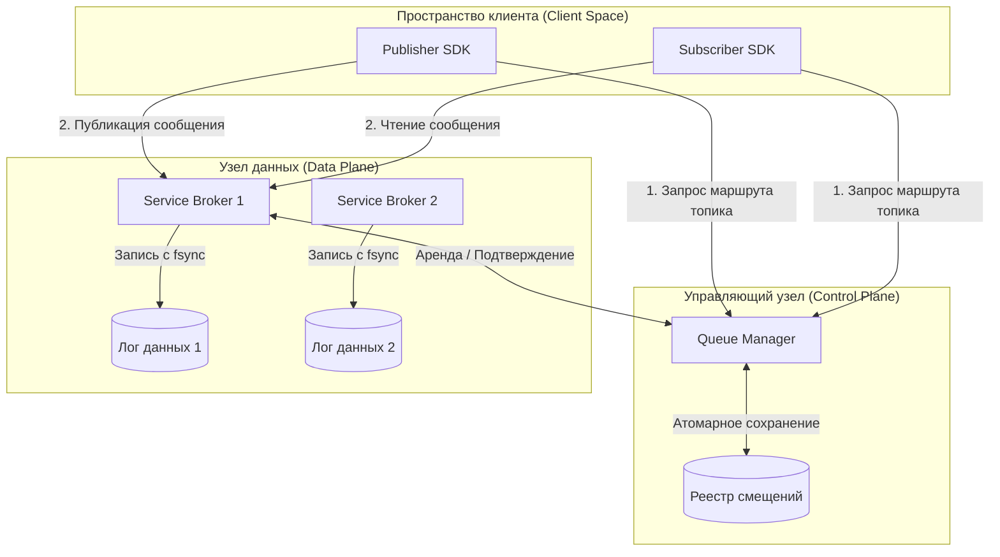

# Распределенный брокер сообщений

Это высоконадежный, конкурентный и отказоустойчивый кластер брокеров сообщений, написанный на **Go**. Система разработана с использованием эффективных подходов к многопоточности и отказоустойчивости, включая мелкогранулярную синхронизацию блокировок, хранилище с низким временем задержки O(1) (append-only log) и индексацией в оперативной памяти, автоматическую маршрутизацию при сбоях и корректную отмену подписок клиентов.

---

## Архитектура системы



### Описание компонентов

1. **Queue Manager (Control Plane / Менеджер очереди)**:
   - **Мелкогранулярная конкурентность**: Используются отдельные мьютексы чтения-записи (`sync.RWMutex`) для реестра брокеров и индивидуальные мьютексы для каждого топика и группы потребителей, что исключает конфликт блокировок.
   - **Атомарное сохранение состояния**: Применяется запись с двойным буферированием (сначала в файл `.tmp`, затем атомарное переименование файла), что предотвращает повреждение сохраненных смещений (offsets) при внезапном отключении сервера.
   - **Автоматическая маршрутизация при сбоях**: При отключении одного из брокеров Queue Manager фиксирует таймаут и динамически переносит его топики на здоровые брокеры.

2. **Service Broker (Data Plane / Брокер данных)**:
   - **Индексируемое O(1) хранилище**: Вместо построчного чтения файлов брокер записывает сообщения в лог (append-only commit log) и сохраняет карту соответствия каждого смещения байтовой позиции в файле (`FilePosition` и `Length`) в оперативной памяти.
   - **Параллельное чтение**: Используются потокобезопасные операции `ReadAt`, позволяющие нескольким подписчикам одновременно читать сообщения с диска без захвата блокировки на запись в файл лога.
   - **Гарантия надежности (Durability)**: Выполняется принудительный сброс данных на диск через `file.Sync()` (`fsync`) перед отправкой ответа `200 OK` издателю.

3. **Go Client SDK (Библиотека клиента)**:
   - **Защита от эффекта "лавины" (Thundering Herd)**: Применяется экспоненциальная задержка со случайным распределением (jitter) при повторных попытках подключения.
   - **Отмена через контекст (Context)**: Цикл опроса подписок использует стандартный Go-контекст `context.Context` для мгновенной и чистой остановки клиента.

---

## Протоколы API

### Queue Manager (Control Plane)
* `POST /brokers/register` — Регистрация брокера при запуске.
* `POST /brokers/heartbeat` — Периодическая отправка хартбитов активными брокерами.
* `POST /topics/register` — Регистрация топика и привязка к брокеру.
* `GET /topics/route?topic=<name>` — Получение адреса активного брокера для топика. Автоматически переназначает топик на другой брокер, если текущий хост оффлайн.
* `POST /qm/lease` — Согласование аренды сообщений для подписчика (длительность блокировки: 10 секунд).
* `POST /qm/ack` — Подтверждение успешной обработки сообщений и коммит смещений.
* `GET /status` — Получение статуса здоровья всей системы.

### Service Broker (Data Plane)
* `POST /publish` — Прием и сохранение сообщений от издателей.
* `POST /fetch` — Доставка арендованных сообщений подписчикам.
* `POST /ack` — Перенаправление подтверждений обработки от подписчиков в Queue Manager.

---

## Меню быстрого запуска

В проекте есть интерактивный скрипт `quick-start.sh`, автоматизирующий локальный запуск и запуск в контейнерах.

Запуск скрипта:
```bash
./quick-start.sh
```

Интерактивные опции:
1. **Вариант 1**: Локальная проверка (компиляция бинарных файлов, запуск серверов, выполнение 4 тестов надежности и их остановка).
2. **Вариант 2**: Запуск кластера из 3 контейнеров через Docker Compose (порты `8080`, `8081`, `8082` пробрасываются на хост).
3. **Вариант 3**: Выполнение демонстрационного теста (публикация и чтение 5 сообщений) внутри запущенного Docker Compose окружения.
4. **Вариант 4**: Плавная остановка контейнеров Docker и очистка временных томов баз данных.

---

## Оркестрация в Docker Compose

Для прямого запуска кластера в контейнерах выполните:
```bash
docker compose up --build -d
```

Будут запущены:
* **Queue Manager**: `http://localhost:8080` (координатор кластера)
* **Broker-1**: `http://localhost:8081` (хранит топики safety-topic и lb-topic)
* **Broker-2**: `http://localhost:8082` (хранит топик broker2-topic)

### Тестирование клиента в контейнере
Чтобы взаимодействовать с кластером без необходимости устанавливать Go на хост-машине, используйте скрипт-прокси `docker-demo.sh`:

* **Отправить сообщения**:
  ```bash
  ./docker-demo.sh -mode publish -topic compose-topic -count 10 -payload "body"
  ```
* **Прочитать сообщения**:
  ```bash
  ./docker-demo.sh -mode subscribe -topic compose-topic -group group-A -id sub-1 -count 10
  ```
* **Проверить статус кластера**:
  ```bash
  ./docker-demo.sh -mode status
  ```

---

## Развертывание в продакшене на нескольких VM

Для продакшн-развертывания на физических или виртуальных машинах запускайте скомпилированные бинарники с нужными флагами:

### VM 1: Координатор кластера (Queue Manager)
```bash
./bin/manager -port 8080 -state /var/lib/message-broker/state.json
```

### VM 2: Service Broker 1
```bash
./bin/broker -id broker-1 -port 8081 -qm http://<VM1_IP>:8080 -addr http://<VM2_IP>:8081 -data /var/lib/message-broker/logs
```

### VM 3: Service Broker 2
```bash
./bin/broker -id broker-2 -port 8082 -qm http://<VM1_IP>:8080 -addr http://<VM3_IP>:8082 -data /var/lib/message-broker/logs
```
