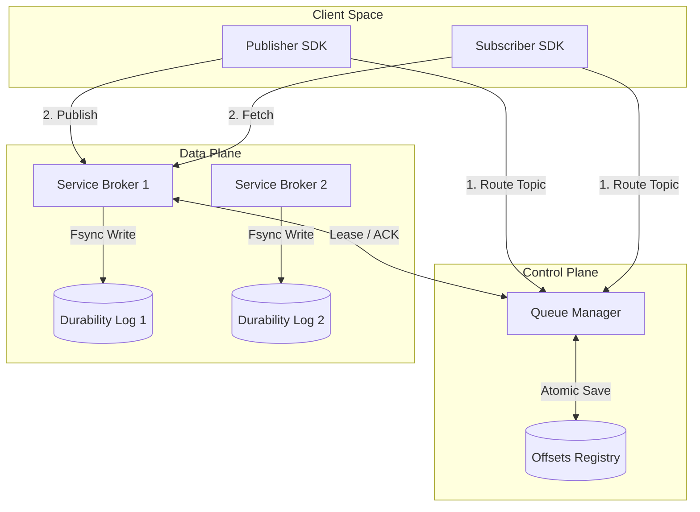

# Distributed Message Broker (Senior Edition)

This is a highly reliable, concurrent, and fault-tolerant message broker cluster written in **Go**. This version is designed with senior engineering practices, featuring fine-grained lock synchronization, a low-latency O(1) append-only storage engine with memory indexing, robust failover auto-routing, and client subscription cancellation.

---

## Architecture Design



### Components Summary

1. **Queue Manager (Control Plane)**:
   - **Fine-Grained Concurrency**: Uses separate read-write mutexes (`sync.RWMutex`) for the broker registry and individual mutexes per topic and consumer group, eliminating lock contention.
   - **Atomic State Saving**: Employs double-buffered writes (saving to `.tmp` first, then atomically renaming the file) to protect offset persistence from corruption during sudden server terminations.
   - **Failover Auto-Routing**: If a broker goes offline, the Queue Manager detects the timeout and dynamically migrates its topics to healthy brokers.

2. **Service Broker (Data Plane)**:
   - **O(1) Indexed Storage Engine**: Instead of parsing files line-by-line, the broker writes messages to an append-only commit log and indexes each offset to its byte position (`FilePosition` and `Length`) in an in-memory map.
   - **Concurrent Reads**: Leverages thread-safe `ReadAt` operations, allowing multiple subscriber fetch requests to read from disk concurrently without acquiring a write lock on the log file.
   - **Durability Guarantee**: Forces physical disk flushing using `file.Sync()` (`fsync`) before returning a `200 OK` status to the publisher.

3. **Go Client SDK**:
   - **Thundering Herd Protection**: Employs exponential backoff with full jitter for connection retries.
   - **Context Cancellation**: The subscription polling loop uses standard Go `context.Context` to handle graceful client shutdown instantly.

---

## API Protocols

### Queue Manager (Control Plane)
* `POST /brokers/register` — Broker startup registration.
* `POST /brokers/heartbeat` — Periodic active broker status check.
* `POST /topics/register` — Topic-to-Broker routing assignment.
* `GET /topics/route?topic=<name>` — Returns the active broker address. Auto-assigns topics to active brokers if the current host goes offline.
* `POST /qm/lease` — Negotiates message lease reservations for a subscriber (lock duration: 10s).
* `POST /qm/ack` — Confirms successful message processing and commits offsets.
* `GET /status` — Displays the system health status.

### Service Broker (Data Plane)
* `POST /publish` — Receives and persists payloads from publishers.
* `POST /fetch` — Delivers leased message batches to subscribers.
* `POST /ack` — Forwards subscriber processing acknowledgments to the Queue Manager.

---

## Quick Start Menu

We provide an interactive launcher `quick-start.sh` that automates both local and containerized deployments.

Run the launcher:
```bash
./quick-start.sh
```

Choose from the interactive menu:
1. **Option 1**: Local verification (compiles binaries, spins up servers, runs the 4 reliability tests, and stops them).
2. **Option 2**: Launches a 3-container cluster via Docker Compose (maps ports `8080`, `8081`, `8082` to the host).
3. **Option 3**: Executes a test run (publishes and consumes 5 messages) inside the running Docker Compose network.
4. **Option 4**: Gracefully stops the container network and purges temporary database volumes.

---

## Docker Compose Orchestration

To run the containerized cluster directly:
```bash
docker compose up --build -d
```

This spins up:
* **Queue Manager**: `http://localhost:8080` (managing cluster consensus)
* **Broker-1**: `http://localhost:8081` (hosting safety-topic and lb-topic)
* **Broker-2**: `http://localhost:8082` (hosting broker2-topic)

### Containerized Client Testing
To interact with the cluster without installing Go locally on your host machine, use the `docker-demo.sh` proxy tool:

* **Publish messages**:
  ```bash
  ./docker-demo.sh -mode publish -topic compose-topic -count 10 -payload "message-body"
  ```
* **Consume messages**:
  ```bash
  ./docker-demo.sh -mode subscribe -topic compose-topic -group group-A -id sub-1 -count 10
  ```
* **Inspect cluster state**:
  ```bash
  ./docker-demo.sh -mode status
  ```

---

## Multi-VM Production Deployment

For production deployments across physical VMs, execute the compiled binaries with appropriate flags:

### VM 1: Cluster Coordinator (Queue Manager)
```bash
./bin/manager -port 8080 -state /var/lib/message-broker/state.json
```

### VM 2: Service Broker 1
```bash
./bin/broker -id broker-1 -port 8081 -qm http://<VM1_IP>:8080 -addr http://<VM2_IP>:8081 -data /var/lib/message-broker/logs
```

### VM 3: Service Broker 2
```bash
./bin/broker -id broker-2 -port 8082 -qm http://<VM1_IP>:8080 -addr http://<VM3_IP>:8082 -data /var/lib/message-broker/logs
```
